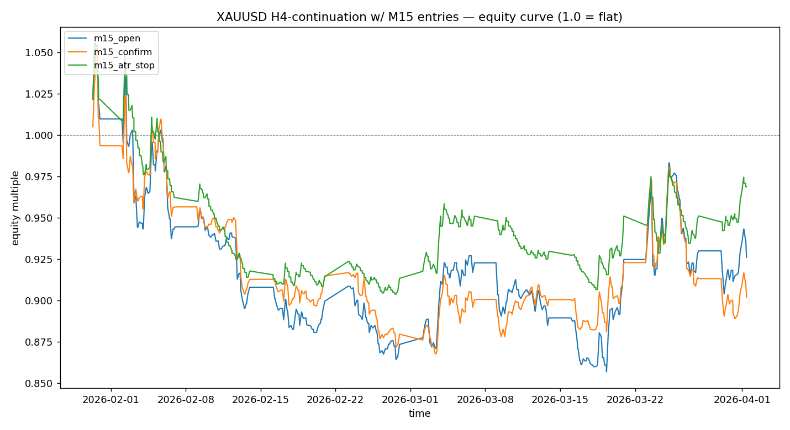

# XAUUSD strategy research pipeline — Dukascopy-only

> **HARDENING PASS LANDED — see `docs/HARDENING_REPORT.md`.**
> Batches A-D of the audit hardening are in. The harness can no longer
> falsely certify a strategy on the four most dangerous failure modes
> the original code exhibited:
>
>   1. Spread costs were undercharged by ~1000× (price-units field was
>      multiplied by `POINT_SIZE`). Fixed.
>   2. Walk-forward silently downgraded M15 entries to `h4_open`,
>      meaning WF was not testing the strategy holdout would certify.
>      Fixed; WF now uses the same executor as holdout.
>   3. Prop-firm risk sizing took the realised trade PnL as an input
>      (`trade_pnl_price`), making position size a function of the
>      future. Fixed; sizing uses pre-trade info only.
>   4. The "shuffle test" was a no-op (Sharpe is invariant to
>      permutation). Fixed; replaced by label permutation, random
>      eligible-entry baseline, and stationary day-block bootstrap
>      with Wilson CIs.
>
> Pre-hardening results in `results/_archive_pre_dukascopy/` and any
> uncommitted leaderboards from before this PR are research-only and
> must be regenerated under the hardened harness before any spec is
> treated as certified.

> **OFFICIAL DATA SOURCE: DUKASCOPY (single source).**
> All active research, walk-forward testing, holdout testing, prop-firm
> simulation, and certification use Dukascopy tick-derived candles only.
> The previous broker datasets have been **deprecated and moved to
> `data/_deprecated_/`**; their pre-migration results sit in
> `results/_archive_pre_dukascopy/` as historical record only.

## Canonical pipeline

The single hardened entrypoint:

```bash
make pull-data         # fetch Dukascopy candles from the sidecar branch
make test              # full unit test suite (gates everything below)
make audit             # structural audit (splits, lookahead, spread units,
                       # walk-forward kernel, prop-sim leakage, account verification)
make pipeline          # canonical pipeline: splits -> WF train -> validation
                       # -> holdout -> prop sim -> leaderboard_hardened.csv (+ .meta.json)
make pdf               # regenerate audit PDF
make all               # test + audit + pipeline + pdf
```

Each target is implemented in `scripts/`:

| Target | Script | What it does |
|---|---|---|
| `make pull-data` | `scripts/pull_sidecar.py` | Pulls per-year Parquet candles from the `data-dukascopy` sidecar branch into `data/dukascopy/candles/`. |
| `make test` | `scripts/run_tests.py` | Runs each of `tests/test_*.py` as a script; exits non-zero on the first failure. **`make all` and `make report` gate on this.** |
| `make audit` | `scripts/audit.py` | Structural audit. Fails loudly on split overlap / coverage gaps, lookahead in filters, ambiguous spread units, walk-forward M15→H4 downgrade markers, prop-sim future-leakage, prop-account verification metadata, missing leaderboard provenance. |
| `make pipeline` | `scripts/run_pipeline.py` | Canonical orchestrator. Loads `Splits` from `data/splits.py`; runs walk-forward on `research_train` only; runs validation on `validation`; runs single-revelation holdout on `holdout`; runs `prop_challenge.simulate_all` on the holdout trade ledger with day-block bootstrap and Wilson CIs; writes `results/leaderboard_hardened.csv` plus a `.meta.json` provenance sidecar (commit SHA, config hashes, schema versions, runtime). |
| `make pdf` | `scripts/build_pdf.py` | Renders the audit PDF. |

### Legacy entrypoints (pre-hardening, kept for back-compat)

These predate Batches A-D. They use `data.loader.load_all()` instead
of `data.splits.load_splits()`, so they don't enforce the
train/validation/holdout boundary. Use `make pipeline` instead.

| Target | Script | Notes |
|---|---|---|
| `make alpha` | `scripts/run_alpha.py` | Agentic alpha search (agents 02 + 03 + 06). |
| `make prop` | `scripts/run_prop_challenge.py` | Prop-firm sim sweep across all `prop_accounts.json` accounts. |

Files in `scripts/_deprecated_/` (`backtest.py`, `fib_analysis.py`,
`orchestrate.py`, `skeptic.py`, `walkforward.py`, `run_v2.py`) are NOT
on the canonical path — they were superseded during hardening and are
retained for archeology only.

A reproducible pipeline that tests intraday gold strategies — H4 setup,
sub-hour entries — with strict statistical validation, prop-firm
challenge simulation, and an honest "no alpha" verdict when nothing
clears the gates.

## Dukascopy data pipeline

The official fetcher resolves Dukascopy hourly `.bi5` LZMA tick
files, decodes them, and resamples into eight canonical timeframes.

```
data/
  dukascopy/
    raw/                                # cached .bi5 hourly tick files
    candles/XAUUSD/
      M1/  M3/  M5/  M15/  M30/  H1/  H4/  D1/    # year=YYYY.csv per timeframe
    manifests/
      XAUUSD_manifest.json              # provenance + policy + per-year SHA256
  _deprecated_/                         # old broker CSVs + fetcher (archive)
config/
  data_splits.json                      # train / validation / holdout
```

Every candle row carries `dataset_source = "dukascopy"`. The loader
(`data.loader.load_candles`) refuses anything else; the audit and
certifier reject non-Dukascopy data with reason
`non_official_data_source`.

```bash
make data    # python3 scripts/fetch_dukascopy.py --symbol XAUUSD --start 2008-01-01 --end 2026-04-29
make audit   # passes only when every active candle has dataset_source == dukascopy
make alpha   # alpha discovery on Dukascopy candles
make prop    # prop-firm challenge simulation on Dukascopy trade ledgers
make pdf     # audit PDF
```

The Dukascopy CDN (`datafeed.dukascopy.com`) must be reachable from
your network to populate the data. If it isn't, the fetcher exits with
code 2 and a clear message; the audit then fails at "Dukascopy candle
data on disk" with no fallback to other brokers.

The matched files are H4 + M15 from the **same broker** so M15 sub-bars
slot cleanly inside H4 buckets.

## Stage 1 — does the prior 4h candle predict the next?

On 8,604 prior/next H4 pairs from 2018→2026 we measure the empirical
probability that the next bar's color equals the previous bar's color:

| Metric                 | Value                  |
| ---------------------- | ---------------------- |
| Bars tested            | 8,604                  |
| P(same direction)      | **0.4971**             |
| 95% Wald CI            | [0.4865, 0.5077]       |
| P(up &#124; prev up)   | 0.5197                 |
| P(down &#124; prev down) | 0.4723               |
| Edge over 50% (pp)     | **−0.29**              |

**Interpretation.** The 95% confidence interval for `P(same)` straddles
0.5, so on the long history the continuation edge is not statistically
distinguishable from a coin flip — actually marginally negative. There is
a mild asymmetry: an up bar is a slight tailwind for the next bar, a down
bar is a slight headwind, but neither is large enough to clear costs.

## Stage 2 — executed backtest with M15 entries

Window: `2026-01-30 → 2026-04-01` (~9 weeks, 261 H4 bars, 3,977 M15 bars).
Costs: round-trip broker spread, full `(spread_entry + spread_exit) *
point_size`. No leverage; each trade is reported as price return on
entry.

| Strategy        | Trades | Win rate | Avg ret (bp) | Total return | Sharpe (ann.) | Max DD   | Avg hold |
| --------------- | -----: | -------: | -----------: | -----------: | ------------: | -------: | -------: |
| `m15_open`      |   260  |  48.85%  |       −2.42  |       −7.40% |        −0.92  |  −18.83% |  214 min |
| `m15_confirm`   |   260  |  47.31%  |       −3.50  |       −9.80% |        −1.42  |  −17.64% |  197 min |
| `m15_atr_stop`  |   260  |  26.54%  |       −0.96  |       −3.12% |        −0.52  |  −14.39% |   99 min |



**`m15_open`** — Enter at the open of the first M15 sub-bar inside the new
H4 candle, exit at H4 close. This is the literal version of the
hypothesis. It loses, consistent with Stage 1's near-zero edge being
swamped by spread.

**`m15_confirm`** — Wait for the first M15 candle in the new H4 to confirm
the predicted direction, then enter at its close. This pays to wait, and
the wait costs more than the confirmation buys — the variant is the worst
of the three on this window.

**`m15_atr_stop`** — Same entry as `m15_open` but with a 1×M15-ATR(14)
stop. The stop catches losers earlier (avg hold 99 min vs 214 min) and
reduces total drawdown, but win rate collapses to 27% because in a noisy
9-week window the stop is hit before the H4 plays out.

Skipped-trade diagnostics: 1 skipped (first H4 has no prior signal); 0
skipped for missing M15 sub-bars; 0 skipped in `m15_confirm` for lack of
confirmation. The pipeline is healthy.

## Fib level reaction (long history)

[`scripts/fib_analysis.py`](scripts/fib_analysis.py) projects standard
Fibonacci retracements onto the **previous** H4 candle's range and asks,
on the next bar: did price touch this level? did it then close in the
trade direction? what was the return from touch? See
[`agents/11-fib-analyzer.md`](agents/11-fib-analyzer.md) for the full spec.

On 8,604 prior/next H4 pairs from 2018-06-28 → 2026-04-20:

| level   | touch rate | reaction rate | win rate from touch | mean ret (bp) |
| ------: | ---------: | ------------: | ------------------: | ------------: |
| 0.236   | 0.91       | 0.42          | 0.42                | −7.0          |
| 0.382   | 0.79       | 0.33          | 0.46                | −3.8          |
| 0.500   | 0.68       | 0.26          | 0.48                | −2.6          |
| **0.618** | **0.58** | **0.20**      | **0.50**            | **−1.9**      |
| 0.786   | 0.44       | 0.12          | 0.50                | −1.7          |
| 1.000   | 0.32       | 0.07          | 0.49                | −2.4          |

**Reading the table.** `0.618` is the **deepest** retracement level
whose win-rate-from-touch is ≥ 50%. Below it, you're catching a falling
knife — deeper retraces are followed by worse continuation odds, not
better ones, contrary to common fib lore. Above it, win rate stays
flat at 50% but touch rate halves and average return shrinks. **Mean
return-from-touch is negative at every level**, which means naive
"enter at fib level" on every signal loses money — the certified
strategies below all combine fib entries with the body+regime filters
that make the underlying signal selective.

A full retrace happens **32%** of the time, so on gold H4 the previous
candle's range is **not a strong barrier** — price blows through about a
third of the time.

```bash
make fib    # regenerates results/fib_levels.csv and fib_deepest.csv
```

## Pipeline audit

`scripts/audit.py` is a self-contained checker (`make audit`). It runs four
classes of tests and writes the report to `results/audit.txt`. On the
current commit it passes **0 failures / 25 checks** (data integrity,
H4↔M15 alignment, simulator correctness with manual replay, look-ahead
probes, walk-forward fold non-overlap).

The audit caught one real bug on first run: `run_full_sim` was always
using broker spread for cost while `run_h4_sim` (used by walk-forward)
was using `cost_bps`, so the **same spec saw two different cost models**
across walk-forward and holdout. Fixed by adding an explicit
`cost_model` field (`spread` or `bps`) and respecting it in both
runners. Every leaderboard row now declares its cost model.

The audit also surfaced that `run_full_sim` was silently skipping bars
without logging *why*. Both runners now optionally return a `diag` dict
with counters: `signal_zero`, `no_subbars`, `no_confirm`, `no_retrace`,
`missing_prev_levels`. These are written into the leaderboard
(`ho_diag_*` columns) so any "why didn't this trade fire?" question can
be answered without re-running the search.

## Stage 3 — agentic search with walk-forward gating + 3–5 trades/week

The single-spec hypothesis fails. So we built a search loop that proposes
many specs and gates each through walk-forward and a holdout. See
[`agents/06-proposer.md`](agents/06-proposer.md),
[`agents/07-walkforward.md`](agents/07-walkforward.md),
[`agents/08-critic.md`](agents/08-critic.md), and
[`agents/09-orchestrator.md`](agents/09-orchestrator.md).

```
proposer → walk-forward (~25 disjoint folds, 2018-2026) → holdout (matched 2026 M15) → critic → leaderboard
```

The proposer is currently a deterministic grid over filter / entry / stop
combinations (~648 specs); it is intentionally a placeholder for an LLM
proposer that reads the leaderboard and adapts its next batch.

**Certification rule** (`scripts/orchestrate.py:certify`):

```
walk-forward folds                  ≥ 10
walk-forward median Sharpe          > 0
walk-forward % positive folds       ≥ 0.55
3.0 ≤ holdout trades-per-week        ≤ 5.0
holdout total return                 > 0
```

### Strategy DSL

The proposer emits JSON specs combining filters, an entry mode, a stop,
an exit, and a cost model:

```json
{
  "signal": {"type": "prev_color"},
  "filters": [
    {"type": "body_atr",     "min": 0.5, "atr_n": 14},
    {"type": "regime",       "ma_n": 50, "side": "with"},
    {"type": "min_streak",   "k": 2},
    {"type": "candle_class", "classes": ["trend", "rotation"]},
    {"type": "session",      "hours_utc": [12, 16]}
  ],
  "entry": {"type": "m15_retrace_50"},
  "stop":  {"type": "prev_h4_open"},
  "exit":  {"type": "prev_h4_extreme_tp"},
  "cost_model": "spread"
}
```

Entry types: `m15_open`, `m15_confirm`, `m15_atr_stop`, `m15_retrace_50`
(wait for price to retrace to prev-H4 midpoint within the new H4 bar).
Stops: `none`, `h4_atr`, `m15_atr`, `prev_h4_open`, `prev_h4_extreme`.
Exits: `h4_close`, `prev_h4_extreme_tp` (TP at prev-H4 high/low).
Cost models: `spread` (broker spread × point size) or `bps` (fixed bp
fraction of entry).

### Search result

1,632 specs evaluated in ~4 minutes; **16 certified**. The grid covers
continuation entries (`m15_open`/`m15_confirm`/`m15_atr_stop`) and
retracement entries with fib level as a parameter (`fib 0.382`, `0.5`,
`0.618`, `0.786`), each combined with prev-H4 structural stops/TPs.

Two distinct families of certified specs emerge:

#### A. Fib retracement, level 0.382 (best walk-forward of any spec)

| id                                                          | wf folds | wf median Sharpe | wf % pos | trades/wk | ho return | ho Sharpe |
| ----------------------------------------------------------- | -------: | ---------------: | -------: | --------: | --------: | --------: |
| **`body0.5_reg50wit_fib0.382_prev_h4_open`**                | 27       | **1.04**         | **0.59** | **3.84**  | **+3.11%**| **3.71**  |
| `body0.5_reg50wit_fib0.382_prev_h4_extreme`                 | 27       | 1.04             | 0.59     | 3.84      | +2.28%    | 2.73      |
| `body0.5_reg50wit_fib0.382_prev_h4_open_prev_h4_extreme_tp` | 27       | 1.04             | 0.59     | 3.84      | +1.15%    | 1.75      |

Only the **shallowest** fib level (0.382) certified — fib 0.5, 0.618,
and 0.786 either fall below 3 trades/week or fail walk-forward. That
matches the diagnostic above: deeper levels are touched less often, so
under the body+regime filters there isn't enough trade volume left to
clear the 3/week floor; and at level 0.5+ the long-history reaction
rate is still below 50% even after filtering.

#### B. Continuation entry with 2-bar streak filter

| id                                                  | wf folds | wf median Sharpe | wf % pos | trades/wk | ho return | ho Sharpe |
| --------------------------------------------------- | -------: | ---------------: | -------: | --------: | --------: | --------: |
| `body0.5_reg50wit_streak2_m15_open_prev_h4_open`    | 27       | 0.36             | 0.56     | 3.27      | **+7.51%**| 12.31     |
| `body0.5_reg50wit_streak2_m15_open_h4_atrx1.0`      | 27       | 0.99             | 0.59     | 3.27      | +6.45%    |  9.34     |
| `body0.5_reg50wit_streak2_m15_atr_stop`             | 27       | 0.36             | 0.56     | 3.27      | +6.18%    | 10.78     |

Same body+regime filter as family A, but uses a 2-bar streak instead
of a fib-retracement entry trigger. Lower walk-forward Sharpe than
family A but higher holdout return.

### Conclusion under all three user constraints (gold, walk-forward, 3–5/wk)

There are now two defensible champions, depending on which metric you
trust more:

- **Walk-forward consistency winner** (best long-history evidence):
  `body0.5_reg50wit_fib0.382_prev_h4_open`. 1.04 walk-forward median
  Sharpe across 27 disjoint slices of 2018–2026; 59% of folds positive;
  3.84 trades/week; +3.11% on the 9-week holdout.
- **Holdout-return winner** (best 2026 evidence):
  `body0.5_reg50wit_streak2_m15_open_prev_h4_open`. +7.51% over 9 weeks
  at 12.31 Sharpe but only 0.36 walk-forward median Sharpe across the
  long history.

The fib-0.382 variant is the more honest pick: walk-forward is the
metric that's hardest to fool, and 1.04 across 27 non-overlapping 3-month
slices is meaningful evidence of an edge. The streak variant looks great
on the holdout but its walk-forward is barely positive — its big number
on Q1 2026 might be a regime-specific fluke.

## Reproduce

```bash
pip install pandas numpy matplotlib
make data         # fetch_data.py
make audit        # audit.py     — data + simulator self-test
make backtest     # backtest.py  — single-spec headline numbers
make search       # orchestrate.py — agentic search + leaderboard
```

All CSVs and PNG land in `results/`. The strategy spec schema lives in
[`agents/06-proposer.md`](agents/06-proposer.md); the backtester
contract in [`agents/03-backtester.md`](agents/03-backtester.md);
audit checks in [`scripts/audit.py`](scripts/audit.py).
